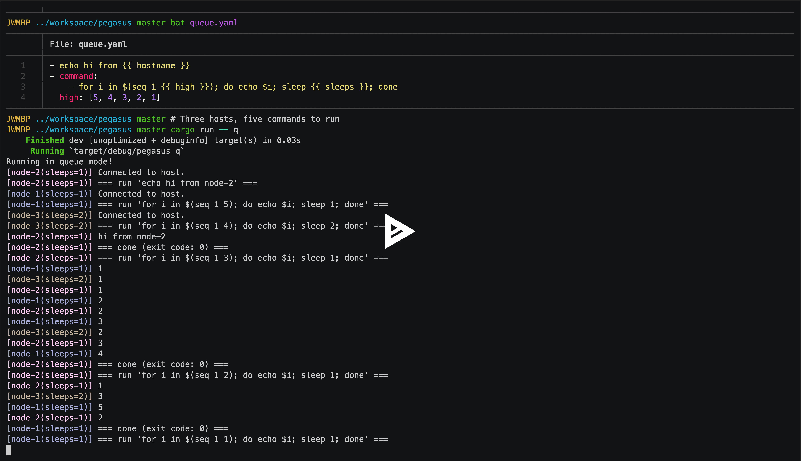

<div align="center">
<h1>Pegasus: A Multi-Node Command Runner</h1>
</div>

Run a list of commands on a set of SSH nodes. With a bit of optional parametrization.

## Demo

[](https://asciinema.org/a/zERwhKrj0AQ3qW0g9RCj8MBsr)

## Features

- Passwordless SSH is all you need.
- **Simple** config for simple use cases, **flexible** config for advanced ones.
- Two modes:
  - **Broadcast** mode runs each command on every node.
  - **Queue** mode runs each command once on the next free node.
- Modify the **file-based queue** (`queue.yaml`) while Pegasus is running.
- **Parametrize** hosts and commands.

## Getting Started with Examples

To use Pegasus,

1. Clone this repo (I'll soon release binaries, too).
2. Setup passwordless SSH for your nodes.
3. Populate `hosts.yaml` and `queue.yaml`, and run Pegasus.

Pegasus will remove one entry at a time from the top of `queue.yaml` and move it to `consumed.yaml` as it begins to execute it.

### Queue Mode: Getting a Bag of Jobs Done

Run four Python commands using two nodes.

```yaml
# hosts.yaml
- node-1
- node-2
```

```yaml
# queue.yaml
- . /opt/miniconda3/etc/profile.d/conda.sh; python train.py --bs 8
- . /opt/miniconda3/etc/profile.d/conda.sh; python train.py --bs 16
- . /opt/miniconda3/etc/profile.d/conda.sh; python train.py --bs 32
- . /opt/miniconda3/etc/profile.d/conda.sh; python train.py --bs 64
```

```console
$ cargo run -- q  # stands for Queue
```

### Broadcast Mode: Terraforming Nodes

Run identical commands for multiple nodes.

```yaml
# queue.yaml
- mkdir workspace
- cd workspace && git clone https://github.com/jaywonchung/dotfiles.git
- . workspace/dotfiles/install.sh
```

```console
$ cargo run -- b  # stands for Broadcast
```

### Parallelizing Execution with Node Parameters

Split nodes into sub-nodes that run commands in parallel. Below, *four* SSH connections are kept, and *four* commands run in parallel.

```yaml
# hosts.yaml
- hostname:
    - node-1
    - node-2
  container:
    - gpu0
    - gpu1
```

When parametrizing nodes, just make sure you specify the `hostname` key.

You can use these parameters in your commands. By the way, the templating engine is Handlebars.

```yaml
# queue.yaml
- docker exec {{ container }} python train.py --bs 8
- docker exec {{ container }} python train.py --bs 16
- docker exec {{ container }} python train.py --bs 32
- docker exec {{ container }} python train.py --bs 64
```

Four sub-nodes and four jobs. So all jobs will start executing at the same time.

### Parametrizing Commands for Conciseness

If you can parametrize nodes, why not commands?

```yaml
# queue.yaml
- command:
    - docker exec {{ container }} python train.py --bs {{ bs }}
  bs: [8, 16, 32, 64]
```

This results in the exact same jobs with the example above.
When parametrizing commands, just make sure you specify the `command` key.

### Quiz

How many commands will execute in Queue mode?

```yaml
# hosts.yaml
- hostname:
    - node-1
    - node-2
  laziness:
    - 1
- hostname:
    - node-3
  laziness:
    - 2
```

```yaml
# queue.yaml
- echo hi from {{ hostname }}
- command:
    - for i in $(seq {{ low }} {{ high }}); do echo $i; sleep {{ laziness }}; done
    - echo bye from {{ hostname }}
  low:
    - 1
    - 2
  high:
    - 3
    - 4
```

Note that although `echo bye from {{ hostname }}` doesn't really use the `low` or `high` parameters, it will run `2 * 2 = 4` times regardless.

The answer is `1 + 2 * 2 * 2`.

### Lock Mode: Modifying the Queue

`queue.yaml` is **actually** the queue.

Pegasus removes the first entry in `queue.yaml` whenver there's a free host available.
If you delete entries before Pegasus pulls it, they will not execute.
If you add entreis to `queue.yaml`, they will execute.

#### Q. Why do I need this?

Think about when the number of remaining commands is less than the number of free nodes. Without a way to submit more jobs to Pegasus, those free nodes will stay idle until all the commands finish and you start a fresh new instance of Pegasus.

By providing a way to add to the queue while commands are still running, users may achieve higher node utilization. Being able to delete from the queue is just a byproduct; adding to the queue is the key feature.

#### Q. But that's a race condition on `queue.yaml`.

Lock mode will lock `queue.yaml` and launch a command line editor for you.

```console
$ cargo run -- l --editor nvim  # l stands for Lock
```

Editor priority is `--editor` > `$EDITOR` > `vim`.
When you save and exit, the queue lock is released and Pegasus is allowed access to `queue.yaml`.

#### Q. What if Pegasus terminates before I add to `queue.yaml`?

Enable daemon mode, and Pegasus will not terminate even if `queue.yaml` is empty. It will stand waiting for you to populate `queue.yaml` again, and execute them.

```console
$ cargo run -- q --daemon
```

## Details

### `queue.yaml`

This is the queue file. Entries in `queue.yaml` are consumed from the top, one by one. Also, entries are consumed only when a new host is available to execute new commands. Consumed entries are immediately appended to `consumed.yaml` in "canonical form", where every entry has a `command` key. Thus you might do something like `tail -n 2 consumed.yaml > queue.yaml` to re-execute your previous single-line command.

As mentioned earlier, always use the Lock Mode when you need to modify `queue.yaml`.

### Broadcast Mode

In broadcast mode, hosts are kept in sync with each other. That is, the next command is fetched from `queue.yaml` and executed on all hosts when all the hosts are done executing the previous command.

Consider the following situation:

```
              fast-host   slow-host
- command1     success     success
- command2     success      fail!
- command3     success
- command4     running
```

In this case, we would want to prepend a undo command for `command2` (e.g., `rm -rf repo || true`) and restart from that, but `fast-host` is already far ahead, making things complicated. Thus, especially when you're terraforming nodes with Pegasus, keeping hosts in sync should be beneficial.

There is also a `-e` or `--error-aborts` flag in Broadcast Mode, which aborts Pegasus automatically when a host fails on a command.

### Ctrl-c Behavior

Pegasus tries to implement graceful termination upon ctrl-c. The following happens:

1. User presses ctrl-c on terminal.
2. Pegasus's ctrl-c handler wakes up and sends out a cancellation notice.
3. The scheduling loop detects this notice and `break`s right before attempting to fetch from `queue.yaml`.
    - It may take some time for the scheduling loop to detect this based on what state it's currently in, but it is guaranteed that once the cancellation notice has been sent out, `queue.yaml` will not change and new commands will not start executing.
4. Commands that are already running **will run until completion**. SSH sessions will close their connections whenever they're free.
    - If you really want everything to burn down, consider running something like `killall pegasus; killall ssh; rm -rf .ssh-connection*`.
5. When all commands finish, Pegasus will exit.
